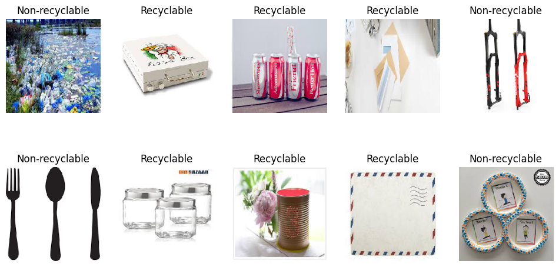
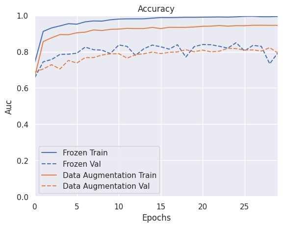
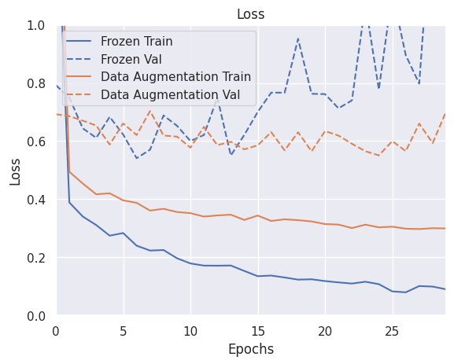
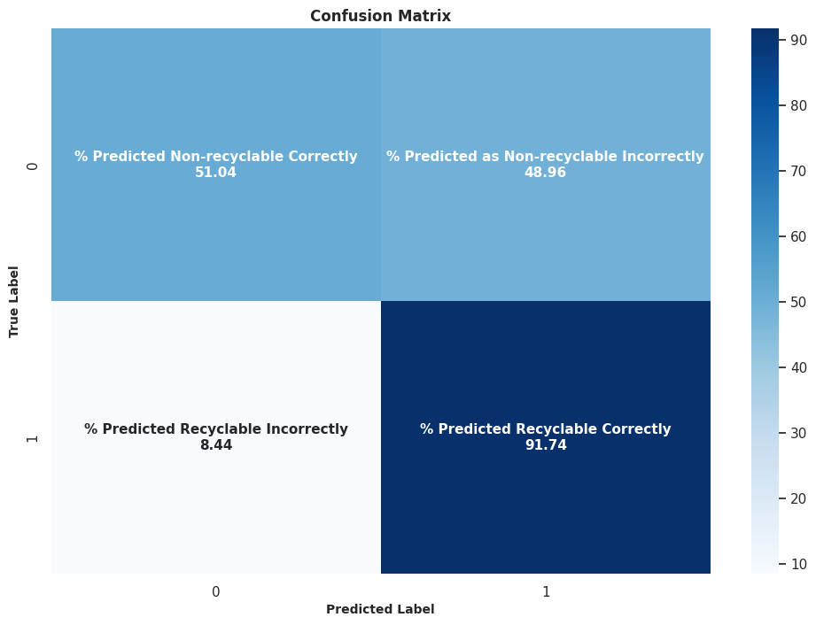

# item-classification-deep-learning
This project is to solve an real life item classification problem using deep learning technology.

<!-- PROJECT SHIELDS -->
[![MIT License][license-shield]][license-url]
[![LinkedIn][linkedin-shield]][linkedin-url]

<!-- PROJECT Image -->
 

  

<!-- ABOUT THE PROJECT -->
## About The Project

Deep learning is widely used in real-life classification tasks across various industries. Its usage included performing product categorization, recommendation systems, visual search in online retail platforms, object detection, tracking and classification in security and surveillance system.

In this project we will construct a deep learning application to solve a non-recyclable waste gets mixed with recyclable waste problem. This real life problem is that some people find it difficult to distinguish recyclable and non-recyclable waste that result in some non-recyclable waste in the recycle bin. For example, soft plastic like plastic bags and polystyrene takeaway boxes are not recyclable but often appear in the recyclable bin of hard plastic.

As a result, we will implement an image classification application using deep learning technology. The application will utilize a neural network model to analyze images of waste items and classify them into the recyclable and non-recyclable categories.

### Built With

* Python 3.6
* Tensorflow 2.5
* Keras 2.12
* Pandas
* IPython
* sklearn

(<a href="#readme-top">back to top</a>)

## Project Plan

### 1. Data Collection

Gather a dataset of images representing different types of recyclable items, such as plastic bottles, aluminum cans, paper products, glass containers

### 2. Data Preprocessing

Resize images to a uniform size, converting them to a standard format. Augment the dataset with techniques including rotation and flippingto increase the diversity of training samples.

### 3. Labelling

Annotate the images with corresponding labels indicating the type of recyclable item depicted in each image.

### 4. Model Development

Convolutional neural network (CNN) is chose for the deep learning architecture and will be developed with the use of pre-trained model VGG19.

### 5. Model Training

The annotated dataset will be splited into training, validation, and test sets. The deep learning model will be trained on the training set using a  optimization algorithm.

### 6. Evaluation

The trained model's performance will be evaluated on the test set with its accuracy, callback and eye ball check result.

(<a href="#readme-top">back to top</a>)

<!-- GETTING STARTED -->
## Getting Started

1. Setup your GPU running machine locally or on the cloud platform
2. Install IPython
3. Clone the git repository
4. Execute the ipython script file in the "code" folder

### Prerequisites

* Basic understanding of python
* Basic knowledge of running python script in IPython environment
* Basic knowledge of neural network structure

### Data Source

7000 Internet downloaded image files where 6000 images are for training and 1000 images are for testing. Among training images, 4000 images are recyclable waste and 2000 images are non-recyclable waste. In the testing image set, recyclable and non-recyclable waste has about 500 images each.

The downloaded images are labelled into recyclable, non-recyclable waste and put into 2 separate folders.

(<a href="#readme-top">back to top</a>)

<!-- Script Work Flow Description -->
## IPython Script Work Flow Description

The script will execute below steps sequencially. 

1. Import libraries
2. Unzip the dataset file
3. Apply a rescale parameter in ImageDataGenerator for a rescaling factor to the pixel values of the images
  * It is to rescale the pixel values to a specific range in order to normalize the data
  * rescale = 1.0/255, the pixel values will be divided by 255, resulting in normalized values between 0 and 1
  * validation_split = 0.2 meaning 80% of the images are for training and 20% are for validation
4. Define callback - monitor the accuracy of validation and save the model's weights during training
5. Model creation using VGG19 as base model
6. Model fitting
7. Check model accuracy
8. Check model loss
9. Launch TensorBoard for model detail review
10. Evaluate overall loss and accuracy for test data
11. Calculate confusion matrix and plot heatmap of the confusion matrix
12. Apply data augmentation to the train dataset
13. Create new model
14. Train new model with data augmentation
15. Compare new model and original model performance 

  

16. Re-plot heatmap of the confusion matrix

  

(<a href="#readme-top">back to top</a>)

<!-- Key Concepts -->
## Key Concepts

### Convolutional neural network (CNN)

A convolutional neural network (CNN) is a type of deep learning algorithm that is specifically designed to analyze and process structured grid data, such as images and video. CNNs have proven to be highly effective for tasks such as image classification, object detection, facial recognition, and more, and have become the cornerstone of modern computer vision systems.

Key components of a typical CNN architecture included:

1. Convolutional Layers - apply a set of learnable filters to the input image to extract features such as edges, textures, and patterns.
2. Activation Function - the most commonly used activation function in CNNs is the Rectified Linear Unit (ReLU).
3. Pooling Layers - max pooling is a commonly used pooling technique, which selects the maximum value from each patch of the feature map.
4. Flattening - converts the spatial information in the feature maps into a format that can be processed by the dense layers.
5. Fully Connected Layers - dense layers.
6. Softmax Layer - enables the network to output probabilities indicating the likelihood of each class.

### Transfer learning

It is a machine learning technique where a model trained on one task is reused or adapted as the starting point for a model on a second related task. Instead of starting the learning process from scratch, transfer learning leverages knowledge gained from solving one problem and applies it to a different, but related, problem domain.

### VGG model

The VGG model is a convolutional neural network (CNN) architecture proposed by researchers at the Visual Geometry Group (VGG) at the University of Oxford. The key characteristic of the VGG model is its simplicity and uniformity in architecture. It consists of multiple convolutional layers followed by max-pooling layers, with smaller 3x3 convolutional filters used throughout the network. The authors experimented with different depths of the network, ranging from VGG-11 (11 layers) to VGG-19 (19 layers), demonstrating that increasing the depth of the network leads to better performance on image classification tasks.

### Data augmentation

It is a technique used to artificially increase the diversity and size of a dataset by applying various transformations to the existing data samples. These transformations modify the original data samples in ways that preserve their semantic content but introduce variations in factors such as appearance, orientation, scale, brightness, and contrast. Data augmentation is commonly used in machine learning and deep learning to improve model generalization, reduce overfitting, and enhance the robustness of models to variations in the input data.

(<a href="#readme-top">back to top</a>)

<!-- Design Explanation -->
## Design Explanation

### Determine the quality of the model

The quality of the model is determined by below measurement:

1. The accuracy metric in the model fitting result of the validation dataset achieves 80% or higher
2. The correction rate of using the model to classify images in the test dataset achieves 80% or higher.

### Model decision

Among the popular CNN models: AlexNet, Inception, ResNet and VGG, VGG is chose due to its simplicity and high performance. After testing I found VGG19 is performing better than VGG16 in this application. Therefore VGG19 is chosen as the final base model.

### Data augmentation

After testing below augmentation are applied to 20% of the image files randomly:

* Zoom 40%
* Image rotation
* Flip horizontal
* Flip Vertical

After performing data augmentation, the evaluation accuracy on the test data increased 0.43% and the evaluate loss decreased 32.16%. Although the model prediction accuracy has increased, the percentage is not that significant. This may be due to the model before performing data augmentation already achieving a good evaluate accuracy (0.803), so the improvement is not large.

However for the evaluation accuracy the improvement is large. When we look at the line chart of model loss against epoch, the model training without data augmentation appears larger fluctuation in loss and much more serious overfitting compared to the model training with data augmentation.

The execution time increased from 1010 seconds to 1925 seconds, which in the other word, increased 90.59%. This means the data augmentation consumes quite a large amount of compute resources to perform.

### Batch normalization

2 batch normalization layers are added into the model.

After applied batch normalization, the new model achieved higher validation accuracy in model training compared with the original model. In the confusion matrix, the new model resulted in 58.95% predicted non-recyclable correctly compared to 51.04% at the original model. Meanwhile, the percentage of predicted recyclable correctly in the new model is less than the original model.

(<a href="#readme-top">back to top</a>)

<!-- LICENSE -->
## License

Distributed under the MIT License. See `LICENSE.txt` for more information.

(<a href="#readme-top">back to top</a>)

<!-- CONTACT -->
## Contact

Oscar Lee 
Email: mail.oscar.lee@gmail.com 
LinkedIn: [https://www.linkedin.com/in/oscarlee1](https://www.linkedin.com/in/oscarlee1) 
Project Link: [https://github.com/oscarlee711/image-classification-neural-network](https://github.com/oscarlee711/image-classification-neural-network)

(<a href="#readme-top">back to top</a>)

<!-- MARKDOWN LINKS & IMAGES -->
[contributors-shield]: https://img.shields.io/github/contributors/othneildrew/Best-README-Template.svg?style=for-the-badge
[contributors-url]: https://github.com/othneildrew/Best-README-Template/graphs/contributors
[forks-shield]: https://img.shields.io/github/forks/othneildrew/Best-README-Template.svg?style=for-the-badge
[forks-url]: https://github.com/othneildrew/Best-README-Template/network/members
[stars-shield]: https://img.shields.io/github/stars/othneildrew/Best-README-Template.svg?style=for-the-badge
[stars-url]: https://github.com/othneildrew/Best-README-Template/stargazers
[issues-shield]: https://img.shields.io/github/issues/othneildrew/Best-README-Template.svg?style=for-the-badge
[issues-url]: https://github.com/othneildrew/Best-README-Template/issues
[license-shield]: https://img.shields.io/github/license/othneildrew/Best-README-Template.svg?style=for-the-badge
[license-url]: https://github.com/othneildrew/Best-README-Template/blob/master/LICENSE.txt
[linkedin-shield]: https://img.shields.io/badge/-LinkedIn-black.svg?style=for-the-badge&logo=linkedin&colorB=555
[linkedin-url]: https://linkedin.com/in/othneildrew
[product-screenshot]: images/screenshot.png
[Next.js]: https://img.shields.io/badge/next.js-000000?style=for-the-badge&logo=nextdotjs&logoColor=white
[Next-url]: https://nextjs.org/
[React.js]: https://img.shields.io/badge/React-20232A?style=for-the-badge&logo=react&logoColor=61DAFB
[React-url]: https://reactjs.org/
[Vue.js]: https://img.shields.io/badge/Vue.js-35495E?style=for-the-badge&logo=vuedotjs&logoColor=4FC08D
[Vue-url]: https://vuejs.org/
[Angular.io]: https://img.shields.io/badge/Angular-DD0031?style=for-the-badge&logo=angular&logoColor=white
[Angular-url]: https://angular.io/
[Svelte.dev]: https://img.shields.io/badge/Svelte-4A4A55?style=for-the-badge&logo=svelte&logoColor=FF3E00
[Svelte-url]: https://svelte.dev/
[Laravel.com]: https://img.shields.io/badge/Laravel-FF2D20?style=for-the-badge&logo=laravel&logoColor=white
[Laravel-url]: https://laravel.com
[Bootstrap.com]: https://img.shields.io/badge/Bootstrap-563D7C?style=for-the-badge&logo=bootstrap&logoColor=white
[Bootstrap-url]: https://getbootstrap.com
[JQuery.com]: https://img.shields.io/badge/jQuery-0769AD?style=for-the-badge&logo=jquery&logoColor=white
[JQuery-url]: https://jquery.com 
